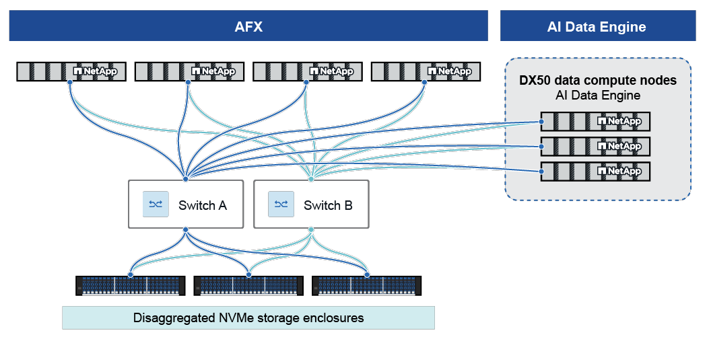

= AI Data Engine 아키텍처
:allow-uri-read: 
:icons: font
:imagesdir: ../media/

[role="lead"]
AIDE는 스토리지와 컴퓨팅을 분리하는 확장 가능하고 내결함성이 뛰어난 아키텍처를 기반으로 구축되어 AI 워크로드에 고성능과 유연성을 제공합니다.

== 물리적 구성 요소

=== AFX 컨트롤러 노드

AFX 컨트롤러 노드는 AFX 환경의 요구 사항을 지원하도록 설계된 ONTAP 소프트웨어의 특수 버전을 실행합니다. 클라이언트는 NFS 및 SMB를 포함한 여러 프로토콜을 통해 노드에 액세스합니다. 각 노드는 스토리지에 대한 완전한 뷰를 가지고 있으며, 클라이언트 요청에 따라 액세스할 수 있습니다. 노드는 중요한 상태 정보를 유지하기 위한 비휘발성 메모리를 갖춘 상태 저장형이며, 대상 워크로드에 특화된 추가 개선 사항을 포함합니다.

AIDE 배포 시 고가용성과 성능을 보장하려면 최소 4개의 AFX 컨트롤러 노드가 필요합니다.

=== 데이터 컴퓨팅 노드

데이터 컴퓨팅 노드(DCN)는 고성능 CPU, RAM 및 GPU 리소스를 갖춘 Linux 기반 서버로, AI 데이터 처리 작업에 특화되어 있습니다. 이러한 노드에서는 메타데이터 카탈로그 작성, 벡터 검색 및 임베딩 파이프라인과 같은 AI 관련 서비스를 호스팅합니다.

AIDE 배포에는 정확히 _3개_의 DCN이 필요합니다.

=== 클러스터/스토리지 스위치

이중화된 고속(100GbE 이상) 스위치는 ONTAP과 DCN을 연결하여 낮은 지연 시간의 데이터 전송과 높은 가용성을 제공합니다.

=== 스토리지 쉘프

고밀도 SSD를 탑재한 NVMe-oF 셸프는 초저지연 및 이중화를 제공하여 PB 규모의 스토리지를 지원합니다.

== 네트워킹

모든 DCN과 ONTAP 스토리지 노드는 이중화된 고속 클러스터 스위치(최소 100GbE)를 통해 연결됩니다. 이러한 아키텍처는 컴퓨팅 및 스토리지 리소스를 분리하여 각각 독립적으로 확장할 수 있도록 하고 성능과 리소스 활용률을 모두 최적화합니다.

DCN과 ONTAP 노드 간의 네트워킹은 클러스터 스위치의 전용 VLAN 및 IPspace를 사용하여 격리됩니다. 이를 통해 데이터 액세스, 관리 API 및 내부 서비스 트래픽과 같은 모든 통신이 안전하고 효율적으로 유지되며 다른 네트워크 작업에 방해되지 않습니다.

== AI Data Engine 주요 기능

AI Data Engine(AIDE)의 주요 기능들은 AI 데이터 라이프사이클을 자동화하고 보호하며 가속화하기 위해 함께 작동합니다. 각 기능은 DCN에서 실행되는 마이크로서비스 세트로 구현되며, ONTAP 스토리지와 통합되고 REST API 및 관리 인터페이스를 통해 제공됩니다.

=== Metadata Engine

Metadata Engine은 NetApp 데이터 환경에 대한 구조화되고 최신이며 대화형 보기를 자동으로 생성합니다.

.라이센스 및 액세스
Metadata Engine은 기본 ONTAP One 라이센스에 포함되어 있으며 AIDE 설치 시 사용할 수 있습니다.

ONTAP System Manager를 통해 액세스할 수 있습니다.

.기능
* AFX 클러스터에 로컬로 저장된 볼륨과 원격 ONTAP 클러스터에서 동기화된 볼륨을 포함하여 모든 데이터 소스의 메타데이터를 카탈로그에 표시합니다.
* 데이터가 수집되거나 변경될 때 메타데이터를 자동으로 추출하고 카탈로그를 채웁니다.
* 메타데이터 쿼리를 위한 REST API 액세스를 제공하여 데이터 전문가와 스토리지 관리자가 데이터를 검색, 분류 및 이해할 수 있도록 합니다.
* 데이터 경로에서 메타데이터 쿼리를 오프로드하여 스토리지 시스템의 NFS 트래픽 부하를 줄입니다.
* 인덱싱 및 검색 기능을 통해 대규모 메타데이터 레코드를 지원합니다.
* 워크스페이스 및 데이터 수집 추상화와 통합하여 액세스 제어 및 거버넌스를 시행합니다.

=== 데이터 동기화

Data Sync는 소스 데이터가 변경되더라도 메타데이터 카탈로그와 데이터 수집이 기본 데이터 소스와 최신 상태를 유지하고 일관성을 갖도록 보장하는 자동화된 백그라운드 서비스입니다.

.라이센스 및 액세스
데이터 동기화 기능은 기본 ONTAP One 라이센스에 포함되어 있지 않으며 별도의 AIDE 라이센스가 필요합니다.

.기능
* 정책 기반 SnapMirror 복제를 사용하여 원격 또는 로컬 ONTAP 클러스터의 데이터를 동기화합니다. 원격 클러스터의 데이터는 AIDE 처리를 위해 로컬 AFX 클러스터로 복사됩니다.
* 감지된 변경 사항에 따라 점진적으로 업데이트되며 수정된 데이터만 전파됩니다.
* 데이터 환경 전반에 걸쳐 안전하고 점진적인 데이터 이동 및 동기화를 제공합니다.
* 작업 공간별로 구성 가능한 새로 고침 빈도로 동기화 간격을 예약하고 모니터링합니다.
* 워크스페이스 생성 워크플로와 통합되어 새로운 데이터 소스가 추가될 때 메타데이터를 추출하고 업데이트합니다.

=== Data Guardrails

Data Guardrails 서비스는 AI 라이프사이클 전반에 걸쳐 민감한 데이터에 대한 지속적이고 자동화된 거버넌스 및 보호 기능을 제공합니다.

.라이센스 및 액세스
Data Guardrails 기능은 기본 ONTAP One 라이센스에 포함되어 있지 않으며 별도의 AIDE 라이센스가 필요합니다.

AI Data Engine Console을 통해 가드레일 기능에 액세스할 수 있습니다.

.기능
* 데이터를 지속적으로 스캔하고 분류하며 범주화합니다.
* PII 탐지와 같은 작업을 위해 내장 및 사용자 정의 가능한 분류기를 사용하여 민감한 데이터와 위험 요소를 식별합니다.
* 정책 기반 삭제, 마스킹 및 액세스 제한을 통해 민감한 데이터 처리를 자동화합니다.
* 작업 공간에 연결된 가드레일 정책을 통해 회사 및 규제 표준을 시행합니다.
* 설정된 대로 민감한 파일 또는 볼륨에 대한 액세스를 제한하고, 감사 로깅 및 규정 준수 보고 기능을 제공합니다.
* 워크스페이스 및 데이터 수집 관리와 통합되어 AI 데이터 워크플로 전반에 걸쳐 Data Guardrails를 일관되게 적용합니다.

=== Data Curator

Data Curator 서비스는 AI 및 GenAI 애플리케이션을 위한 빠른 데이터 검색, 탐색, 벡터화 및 검색을 지원합니다.

.라이센스 및 액세스
Data Curator 기능은 기본 ONTAP One 라이센스에 포함되어 있지 않으며 별도의 AIDE 라이센스가 필요합니다.

AI Data Engine Console을 통해 Data Curator에 액세스할 수 있습니다.

.기능
* 중앙 집중식 메타데이터 카탈로그를 사용하여 관련 데이터에 대한 스토리지를 검색합니다.
* 데이터 과학자가 선별된 데이터 컬렉션을 생성할 수 있는 툴을 제공합니다.
* 스토리지 계층에서 벡터 임베딩을 자동으로 생성합니다.
* 벡터 의미 검색 및 재순위 지정을 지원하는 AI 애플리케이션을 위한 안전한 검색 엔드포인트를 제공합니다.
* Retrieval-Augmented Generation(RAG) 파이프라인 및 에이전트 기반 AI 프레임워크를 포함한 AI 도구 및 기술과 통합됩니다.
* 프로그래밍 방식으로 데이터 수집, 벡터 검색 및 검색 엔드포인트에 액세스할 수 있는 REST API를 제공합니다.

== 보안 및 멀티 테넌시(multi-tenancy)

이 플랫폼은 역할 기반 액세스 제어(RBAC)와 리소스 수준 액세스 제어 목록(ACL)을 모두 적용합니다. 모든 API 및 사용자 작업은 감사되며, 모든 데이터는 저장 시와 전송 시 모두 암호화됩니다. 개별 테넌트는 데이터 및 메타데이터에 대해 격리됩니다.

.관련 정보
* link:../install-setup/install-license-task.html["AIDE 라이선스를 설치하세요"]
* link:../vectorization/zero-to-rag.html["Data-to-RAG 빠른 시작"]

