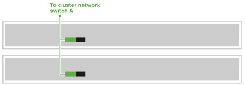

= AI Data Engine용 타사 서버 케이블 연결
:allow-uri-read: 
:icons: font
:imagesdir: ../media/

[role="lead"]
타사 서버를 호스트 네트워크 및 클러스터 네트워크 스위치에 연결하여 AI 워크로드 처리 및 AFX 1K 스토리지 시스템과의 통합을 지원합니다. 이 절차는 호스트 네트워크 액세스 및 클러스터 통신을 위한 연결을 모두 사용하므로 노드가 AFX 시스템의 전원을 끄지 않고도 기존 클러스터 인프라를 활용할 수 있습니다.

.이 작업 정보
이 절차는 일반적인 구성을 보여줍니다. 구체적인 케이블 연결은 스토리지 시스템과 호환되는 구성 요소에 따라 다릅니다. 포괄적인 구성 세부 정보는 타사 서버 설명서를 참조하십시오.

.시작하기 전에
* 기존 AFX 1K 스토리지 시스템이 설치되어 있습니다. AFX 1K 스토리지 시스템 설치에 대한 자세한 내용은 link:https://docs.netapp.com/us-en/ontap-afx/install-setup/install-setup-workflow.html["AFX 1K storage system 설치 설명서"^]을 참조하십시오.
* 필요한 네트워크 스위치가 설치 및 구성되어 있습니다. 시스템을 네트워크 스위치에 연결하는 방법에 대한 자세한 내용은 네트워크 관리자에게 문의하십시오.
* 타사 서버에 필요한 케이블 연결 요구 사항을 검토하셨습니다. 케이블 연결 구성에 대한 자세한 내용은 타사 서버 설명서를 참조하십시오.

NOTE: AI Data Engine software 배포에는 타사 서버 3개가 필요합니다.

== 1단계: 타사 서버를 호스트 네트워크에 연결합니다

타사 서버의 경우 호스트 네트워크에 연결하십시오.

.단계
. 타사 서버의 'b' 100GbE 네트워크 포트를 서버의 네트워크 인터페이스 카드(NIC) 및 스위치 포트 유형에 따라 적절한 케이블을 사용하여 이더넷 데이터 네트워크 스위치 A에 연결하십시오.
+
예를 들면 다음과 같습니다.

+
** 타사 서버 1, 포트 'e4b'
** 타사 서버 2, 포트 'e4b'
+
*100GbE 케이블*

+
image::../media/oie_cable100_gbe_qsfp28.png[100Gb 이더넷 케이블]

+
image::../media/drw_aide_server_host_a_ieops-2831.svg[이더넷 네트워크에 케이블 연결]

. 타사 서버의 'b' 100GbE 네트워크 포트를 서버의 네트워크 인터페이스 카드(NIC) 및 스위치 포트 유형에 맞는 케이블을 사용하여 이더넷 데이터 네트워크 스위치 B에 연결하십시오. 예를 들면 다음과 같습니다.
+
** 타사 서버 1, 포트 'e5b'
** 타사 서버 2, 포트 'e5b'
+
*100GbE 케이블*

+
image::../media/oie_cable100_gbe_qsfp28.png[100Gb 이더넷 케이블]

+
image::../media/drw_aide_server_host_b_ieops-2832.svg[이더넷 네트워크에 케이블 연결]

NOTE: 특정 포트 구성 및 케이블 유형에 대해서는 타사 서버 설명서를 참조하십시오.

== 2단계: 클러스터 연결 케이블 연결

타사 서버의 경우 클러스터 연결을 케이블로 연결합니다.

.단계
. 타사 서버의 네트워크 인터페이스 카드(NIC) 및 스위치 포트 유형에 따라 적절한 케이블을 사용하여 타사 서버의 'a' 100GbE 클러스터 네트워크 포트를 클러스터 네트워크 스위치 A에 연결하십시오.
+
예를 들면 다음과 같습니다.

+
** 타사 서버 1, 포트 'e4a'
** 타사 서버 2, 포트 'e4a'
+
*100GbE 케이블*

+
image::../media/oie_cable100_gbe_qsfp28.png[100Gb 이더넷 케이블]

+

. 타사 서버의 'a' 100GbE 클러스터 네트워크 포트를 서버의 네트워크 인터페이스 카드(NIC) 및 스위치 포트 유형에 따라 적절한 케이블을 사용하여 클러스터 네트워크 스위치 B에 연결하십시오.
+
예를 들면 다음과 같습니다.

+
** 타사 서버 1, 포트 'e5a'
** 타사 서버 2, 포트 'e5a'
+
*100GbE 케이블*

+
image::../media/oie_cable100_gbe_qsfp28.png[100Gb 이더넷 케이블]

+
image::../media/drw_aide_server_cluster_cabling_b_ieops-2834.svg[이더넷 네트워크에 케이블 연결]

NOTE: 특정 포트 구성 및 케이블 유형에 대해서는 타사 서버 설명서를 참조하십시오.

.다음 단계
하드웨어를 케이블로 연결한 후 link:power-on-hardware.html["타사 서버의 전원을 켭니다"].
