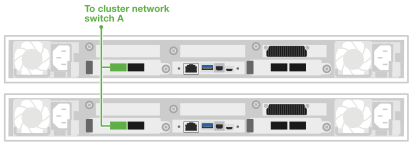

= AI Data Engine용 Data Compute Node 케이블 연결
:allow-uri-read: 
:icons: font
:imagesdir: ../media/

[role="lead"]
AI 워크로드 처리 및 AFX 1K 스토리지 시스템과의 통합을 지원하려면 데이터 컴퓨팅 노드를 호스트 네트워크 및 클러스터 네트워크 스위치에 연결하십시오. 이 절차는 호스트 네트워크 액세스와 클러스터 통신 모두에 100GbE 연결을 사용하므로 AFX 시스템의 전원을 끄지 않고도 노드가 기존 클러스터 인프라를 활용할 수 있습니다.

.이 작업 정보
이 절차는 일반적인 구성을 보여줍니다. 구체적인 케이블 연결은 스토리지 시스템에 주문한 구성 요소에 따라 다릅니다. 포괄적인 구성 세부 정보 및 슬롯 우선순위는 link:https://hwu.netapp.com["NetApp Hardware Universe"^]을 참조하십시오.

NOTE: Data Compute Node를 케이블로 연결할 때 AFX 1K 스토리지 시스템의 전원을 끌 필요가 없습니다. 이미 전원이 켜져 있고 구성된 기존 AFX 1K 스토리지 시스템에 Data Compute Node를 추가할 수 있습니다.

.시작하기 전에
* 기존 AFX 1K 스토리지 시스템이 설치되어 있습니다. AFX 1K 스토리지 시스템 설치에 대한 자세한 내용은 link:https://docs.netapp.com/us-en/ontap-afx/install-setup/install-setup-workflow.html["AFX 1K storage system 설치 설명서"^]을 참조하십시오.
* 필요한 네트워크 스위치가 설치 및 구성되어 있습니다. 시스템을 네트워크 스위치에 연결하는 방법에 대한 자세한 내용은 네트워크 관리자에게 문의하십시오.
* link:../install-setup/cable-overview.html["Data Compute Node에 필요한 케이블링"]를 검토했습니다.

== 1단계: Data Compute Node를 호스트 네트워크에 연결합니다

Data Compute Node 포트를 호스트 네트워크에 연결할 수 있습니다.

.단계
. 다음 Data Compute Node의 e4b 포트를 이더넷 데이터 네트워크 스위치 A에 연결하십시오.
+
** Data Compute Node 1, 포트 e4b
** Data Compute Node 2, 포트 e4b
+
*100GbE 케이블*

+
image::../media/oie_cable100_gbe_qsfp28.png[100Gb 이더넷 케이블]

+
image::../media/drw_aide_network_cabling_a_ieops_2647.svg[이더넷 네트워크에 케이블 연결]

. 다음 Data Compute Node의 e5b 포트를 이더넷 데이터 네트워크 스위치 B에 연결하십시오.
+
** Data Compute Node 1, 포트 e5b
** Data Compute Node 2, 포트 e5b
+
*100GbE 케이블*

+
image::../media/oie_cable100_gbe_qsfp28.png[100Gb 이더넷 케이블]

+
image::../media/drw_aide_network_cabling_b_ieops-2648.svg[이더넷 네트워크에 케이블 연결]

== 2단계: Data Compute Node 클러스터 연결 케이블 연결

Data Compute Node의 경우 클러스터 연결에 e4a/e5a 포트가 사용됩니다.

.단계
. 다음 Data Compute Node의 e4a 포트를 클러스터 네트워크 스위치 A의 비ISL 포트에 연결하십시오.
+
** Data Compute Node 1, 포트 e4a
** Data Compute Node 2, 포트 e4a
+
*100GbE 케이블*

+
image::../media/oie_cable100_gbe_qsfp28.png[100Gb 이더넷 케이블]

+

. 다음 Data Compute Node의 e5a 포트를 클러스터 네트워크 스위치 B의 비ISL 포트에 연결하십시오.
+
** Data Compute Node 1, 포트 e5a
** Data Compute Node 2, 포트 e5a
+
*100GbE 케이블*

+
image::../media/oie_cable100_gbe_qsfp28.png[100Gb 이더넷 케이블]

+
image::../media/drw_aide_switched_cluster_cabling_b_ieops-2650.svg[이더넷 네트워크에 케이블 연결]

.다음 단계
하드웨어를 케이블로 연결한 후 link:power-on-hardware.html["Data Compute Node의 전원을 켜세요"].
